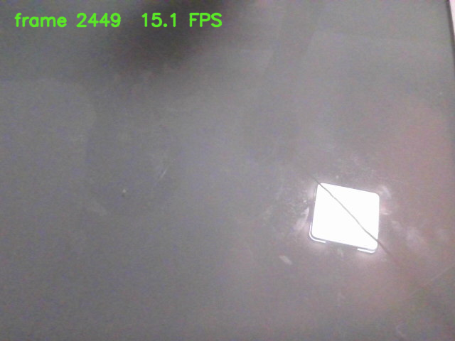

# 摄像头监控作业

这个目录是摄像头作业的重构版本。原始程序在 `starter/main.cpp`，功能已经能用，但参数解析、摄像头读取、窗口显示、按键处理、截图保存和错误处理都写在一个 `main()` 里。现在把这些职责拆成了几个独立组件，外部使用方式保持不变：

```text
sturdy-guide-camera [--device INDEX] [--width PIXELS] [--height PIXELS]
```

运行时按 `S` 保存截图，按 `Q` 或关闭窗口退出。原始单文件版本仍然保留在 `starter/` 里作对照，默认不参与最终程序构建。

## 构建和运行

从仓库根目录执行：

```bash
cmake -S . -B build-camera -G Ninja \
  -DCMAKE_CXX_COMPILER=g++ \
  -DSTURDY_GUIDE_BUILD_CAMERA_HOMEWORK=ON

cmake --build build-camera
ctest --test-dir build-camera --output-on-failure
./build-camera/sturdy-guide-camera --device 0 --width 640 --height 480
```

如果摄像头支持更高分辨率，也可以把宽高改成 `1280x720`。在 WSL2 通过 USB/IP 使用摄像头时，低分辨率 MJPG 模式通常更稳定，所以本地截图使用的是 `640x480`。

如果想编译原始起点程序作比较，可以额外打开这个选项：

```bash
cmake -S . -B build-camera -G Ninja \
  -DSTURDY_GUIDE_BUILD_CAMERA_HOMEWORK=ON \
  -DSTURDY_GUIDE_BUILD_CAMERA_STARTER=ON
```

原始程序会输出为 `sturdy-guide-camera-starter`，不会和重构后的 `sturdy-guide-camera` 冲突。

## 目录结构

```text
camera_monitor/
├── starter/main.cpp        原始单线程程序
├── include/camera/         公共接口
├── src/                    摄像头核心库实现
├── app/main.cpp            参数解析和依赖组装
├── tests/                  不依赖真实摄像头的测试
├── docs/run-screenshot.png 本地运行截图
└── CMakeLists.txt          OpenCV、Threads 和子目录编排
```

几个主要类的职责如下：

- `FrameSource`：摄像头数据源接口，负责定义 `open()`、`read()` 和 `close()`。
- `OpenCvCamera`：真实摄像头实现，内部使用 `cv::VideoCapture`。在 Linux 下优先使用 V4L2 后端，并请求 MJPG 格式，减少 USB 摄像头传输压力。
- `FakeFrameSource`：测试用假数据源，可以生成固定帧、空帧和读取失败，不会打开真实硬件。
- `CameraSession`：采集会话，独占一个 `FrameSource`，管理后台采集线程、停止状态、两帧缓冲和错误传递。
- `PreviewApplication`：主线程应用，负责窗口显示、按键处理、文字叠加和截图保存。

核心逻辑被编译成 `sturdy_guide_camera_core` 库，应用程序和测试都链接这个库。这样测试可以直接测采集会话和缓冲区逻辑，不需要打开真实摄像头。

## 线程和资源处理

`CameraSession` 通过 `std::unique_ptr<FrameSource>` 独占摄像头数据源。`start()` 会先打开数据源，再启动后台线程持续读取画面。`stop()` 会请求后台线程停止，唤醒等待中的主线程，然后等待工作线程 `join()`。析构函数也会调用 `stop()`，避免对象销毁后后台线程还在访问摄像头资源。

内部缓冲区最多保存两帧。后台采集速度快于主线程显示速度时，会丢掉最旧的帧，只保留较新的画面。实时预览更关心当前画面，保留太多历史帧只会增加内存占用和显示延迟。

`CameraSession` 的 mutex 只保护状态、错误信息、帧缓冲和计数器。摄像头读取、窗口显示和图片保存都在锁外执行，因为这些操作可能被硬件、窗口系统或磁盘 I/O 阻塞。锁只负责保护共享状态的一次完整转换。

后台线程里如果遇到读取异常、读取失败或空帧，会把错误信息记录到 `errorMessage()`，请求停止并唤醒主线程。主线程看到错误后正常退出并打印提示。

## 测试

自动测试使用 `FakeFrameSource`，不依赖真实摄像头。覆盖内容包括：

- `start()` 后能取得递增序号的帧；
- 运行中重复调用 `start()` 不会重复打开设备；
- 连续调用 `stop()` 不会崩溃或死锁；
- 对象析构时会停止并收束后台线程；
- 消费较慢时缓冲区最多保留两帧，并丢弃旧帧；
- 假设备抛出的读取错误能被主线程观察到；
- 空帧不会被发布为有效画面；
- `stop()` 后重新 `start()` 会重置本轮统计。

本地运行结果：

```text
Test project /home/qpj/workspaces/srm/sturdy-guide/build-camera
1/4 Test #1: midi_player_test .................   Passed
2/4 Test #2: camera_session_test ..............   Passed
3/4 Test #3: greeting_test ....................   Passed
4/4 Test #4: text_test ........................   Passed

100% tests passed, 0 tests failed out of 4
```

## 真机运行截图

本地环境是 Windows 11 + WSL2 Ubuntu。摄像头通过 `usbipd-win` 连接到 WSL，在 Linux 侧以 `/dev/video0` 暴露；窗口由 WSLg 显示到 Windows 桌面。

运行命令：

```bash
./build-camera/sturdy-guide-camera --device 0 --width 640 --height 480
```

窗口出现后按 `S` 保存截图：


