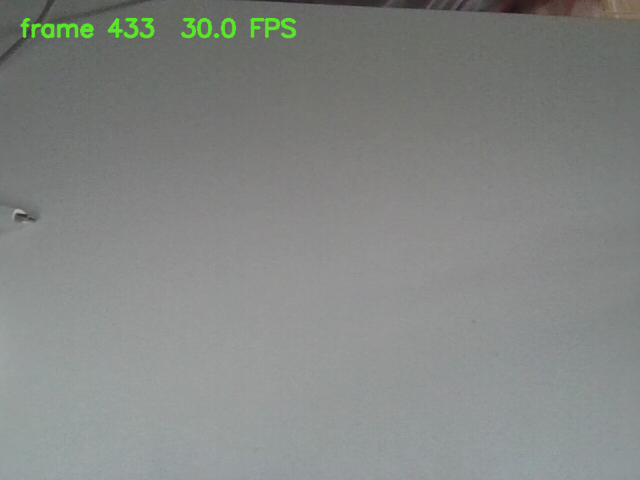

# 摄像头监视器

`sturdy-guide-camera` 是摄像头作业的多线程版本。原始单线程程序保留在
`starter/` 中用于对照，并且不会被最终 target 编译。


## 目录结构

```text
camera_monitor/
├── ASSIGNMENT.md           作业要求
├── CMakeLists.txt           查找依赖并编排子目录
├── README.md                构建、运行和设计说明
├── starter/
│   ├── CMakeLists.txt       起始版本的构建配置，仅保留对照
│   └── main.cpp             原始单线程参考实现，仅保留对照
├── include/camera/
│   ├── frame_source.hpp     设备抽象接口
│   ├── opencv_camera.hpp    OpenCV VideoCapture 后端
│   ├── fake_frame_source.hpp 确定性的测试后端
│   ├── camera_session.hpp   工作线程与有界帧缓冲区
│   └── preview_application.hpp 主线程预览边界
├── src/
│   ├── CMakeLists.txt       核心库 target
│   ├── camera_session.cpp   采集会话实现
│   ├── fake_frame_source.cpp 假设备实现
│   ├── opencv_camera.cpp    OpenCV 摄像头实现
│   └── preview_application.cpp 主线程窗口与截图实现
├── app/
│   ├── CMakeLists.txt       应用 target
│   └── main.cpp             参数解析与依赖组装
└── tests/
    ├── CMakeLists.txt       CTest 注册
    └── camera_monitor_test.cpp 不依赖真实摄像头的测试
```

`CameraSession` 通过 `std::unique_ptr` 独占 `FrameSource`。`main()` 拥有
`CameraSession`，`PreviewApplication` 仅在 `main()` 保持会话存活期间持有其
引用。工作线程属于 `CameraSession`；在析构函数销毁来源对象前，会先停止并
`join()` 该工作线程。

## 重构前后职责对比

| 职责 | 重构前 | 重构后 |
| --- | --- | --- |
| 参数解析与依赖组装 | `starter/main.cpp` 的 `main()` | `app/main.cpp` |
| 真实设备访问 | `main()` 直接使用 `cv::VideoCapture` | `OpenCvCamera` 实现 `FrameSource` |
| 确定性测试设备 | 不具备 | `FakeFrameSource` |
| 后台采集、停止与 join | 不具备 | `CameraSession` |
| 有界最新帧缓冲 | 不具备 | `CameraSession` 最多保存两帧 |
| 窗口、按键、叠字和截图 | `main()` | `src/preview_application.cpp` 中的 `PreviewApplication` |
| 自动化测试 | 依赖真实设备，无法稳定测试 | `FakeFrameSource` + CTest |

## 工程与 CMake 关系

`src/CMakeLists.txt` 将 `CameraSession`、`OpenCvCamera`、`FakeFrameSource` 和
`PreviewApplication` 编译为核心库 target `sturdy_guide_camera_core`，并提供
`SturdyGuide::camera_core` 别名。该库公开链接 `Threads::Threads` 与 OpenCV
提供的库和头文件。

`app/CMakeLists.txt` 将 `app/main.cpp` 链接到核心库，并输出最终程序
`sturdy-guide-camera`。窗口循环的实现位于核心库中的
`src/preview_application.cpp`，但实际运行仍由主线程执行。
`tests/CMakeLists.txt` 将硬件无关测试链接到同一个核心库，再使用 `add_test()`
注册为 CTest 测试。`starter/` 保留原始单线程实现，但不会被最终 target 编译。

## 线程安全契约

本工程由两个线程协作，职责分工如下：

- **后台工作线程**：由 `CameraSession::run()` 执行，循环调用
  `FrameSource::read()` 读取帧并写入有界缓冲。
- **主（控制）线程**：运行 `PreviewApplication::run()`，负责取帧显示、处理键盘、
  截图，以及调用 `start()` / `stop()` 等控制操作。

下面 8 条契约明确资源所有权、状态机、并发调用规则、锁保护范围和生命周期顺序。

### 状态机

`CameraSession` 采用显式状态机管理生命周期：

```text
Ready --start()--> Running --stop()--> Stopping --> Stopped
                       |                  |
                       +--read error--> Failed
Ready --stop()--> Stopped
Stopped / Failed --(终态，不可再启动)
```

| 状态 | 含义 |
| --- | --- |
| `Ready` | 初始状态，尚未 `start()` |
| `Running` | 工作线程正在采集 |
| `Stopping` | 已请求停止，正在 `join()` 工作线程 |
| `Stopped` | 工作线程已结束 |
| `Failed` | 采集过程发生非"主动停止"的读帧错误 |

### 1. 资源所有权与生命周期

- `CameraSession` 通过 `std::unique_ptr<FrameSource>` **独占**设备来源；
  构造时注入所有权，析构时释放。
- `main()` 拥有 `CameraSession`；`PreviewApplication` 只持有 `CameraSession&`
  **引用**。`main()` 中 `session` 声明在 `application` 之前，保证会话存活时间更长。
- 工作线程**不拥有**任何资源：它借用 `this`（`run()`）与被注入的 `source_`，
  由 `stop()` + `join_worker()` 保证线程在对象析构前已结束，不会访问已销毁对象。

### 2. 状态与合法转换

- 初始为 `Ready`，仅允许 `Ready -> Running`（`start()`）。
- 会话**只能启动一次**：因为 `request_stop()` 可能永久关闭硬件来源，
  第二次 `start()` 抛出 `std::logic_error`。
- `stop()` 使 `Running -> Stopping -> Stopped`；`Ready` 时调用 `stop()` 直接到 `Stopped`。
- 未由停止请求引起的读帧异常使会话进入 `Failed`。
- `Stopped` 与 `Failed` 均为终态，不能回到 `Ready`。

### 3. 可并发调用的方法

- `start()` 与 `stop()` 由 `lifecycle_mutex_` 串行化，**不可并发交错**。
- `stop()` 是幂等的、线程安全的，可被多个控制调用方调用。
- 工作线程采集期间，主线程可安全并发调用：
  `try_take_latest()`、`buffered_frame_count()`、`state()`、`rethrow_if_error()`。
- **对象析构不能与任何成员函数调用并发**（析构是唯一不允许并发调用的时刻）。

### 4. mutex 保护范围与不变量

`mutex_` 保护以下共享成员：`state_`、`stop_requested_`、`worker_`（线程句柄）、
`frames_`（帧队列）、`worker_error_`（后台异常）、`next_sequence_`（帧序号）。

不变量：
- 状态转换是原子的（读改写状态必须持锁）。
- 帧队列**最多两帧**，且**序号不会递减**（递增）。
- 线程句柄 `worker_` 只在持锁时被读写；需要 `join()` 时先把它 `move` 到局部变量、
  出锁后 join，避免持锁 join 造成死锁。
- `worker_error_` 的读写原子化（生产者捕获、消费者重抛）。

`lifecycle_mutex_` 保护"`start()`/`stop()` 不重叠"这一生命周期不变量。

### 5. 缓冲区满时的丢帧策略

当第三张有效帧到达时（`frames_.size() == 2`），工作线程先
`frames_.pop_front()` **丢弃最旧的一帧**，再 `push_back` 最新帧。
`try_take_latest()` 则取 `frames_.back()`（最新帧）并 `clear()` 清空其余旧帧。

**为什么丢最旧帧**：实时视频消费者只关心最新画面，旧帧已被淘汰、毫无价值。
丢弃最旧帧既保证**内存有界（最多 2 帧）**，又让 UI 始终拿到最新帧，
**优先保证低延迟预览**，而不是试图显示每一帧。

### 6. 为什么锁外执行 I/O

`FrameSource::read()`、`cv::imshow()`、`cv::imwrite()` 可能阻塞在设备、
窗口事件循环或文件系统上。若**持有帧 mutex** 执行它们：

- 工作线程读帧时会长时间占用锁，`stop()` 等所有需要该锁的方法都会被卡住，
  无法中断，甚至造成死锁。
- 消费线程 `imshow`/`imwrite` 会长时间持锁，阻塞生产者与停止操作。

因此锁**只保护共享状态的完整转换**，慢速 I/O 一律放在临界区之外：
`read()` 在锁外调用；`imshow()`/`imwrite()` 使用 `try_take_latest()` 取出、
已脱离 `CameraSession` 锁控制的 `cv::Mat`。

### 7. 后台异常如何越过线程边界

工作线程的 `run()` 用 `try/catch` 包裹循环；发生异常时执行：

```cpp
worker_error_ = std::current_exception();   // 捕获为 std::exception_ptr
state_ = CameraSessionState::Failed;
```

`std::exception_ptr` 持有异常的副本，可安全跨线程传递（不会 `std::terminate`）。
主线程在事件循环中调用 `rethrow_if_error()`：持锁取出指针并
`std::rethrow_exception()` 在调用线程重新抛出，从而观察并报告后台错误。
同时区分"关闭型中断"与真实故障：仅当 `stop_requested_` 为假时，异常才被记为故障。

### 8. 析构、停止、唤醒与 join 的顺序

`~CameraSession()` 调用 `stop()`，内部顺序严格如下，**不可颠倒**：

1. **写入停止请求**（持 `mutex_`）：`stop_requested_ = true`，`Running -> Stopping`。
2. **唤醒工作线程**（锁外）：调用 `source->request_stop()`——
   对真实摄像头是设置原子标志并 `camera_.release()` 以解除阻塞中的 `read()`；
   对假源是置位并 `condition_variable.notify_all()`。
3. **转移并等待线程结束**（锁外）：`join_worker()` 把线程句柄 `move` 出锁，
   再在锁外 `join()`。
4. **收尾状态**（持 `mutex_`）：`Stopping -> Stopped`。

必须**先唤醒、再 join**（否则 join 会一直等待阻塞中的 `read()`）；
`join()` 完成后才销毁 `FrameSource`。主动停止导致的后端读取错误不会作为
用户可见错误报告。

## 测试

本小节说明 `camera_monitor_test` 如何不依赖任何真实摄像头，仅用 `FakeFrameSource` 对 `CameraSession` 的并发与状态行为做确定性验证。 
测试程序 `tests/camera_monitor_test.cpp` 由 7 个独立的 `test_*` 函数组成， `main()` 依次执行并把结果累加，全部通过时返回 0，否则返回 1（CTest 判定）。

- `FakeFrameSource`：实现 `FrameSource` 接口，行为完全由 `FakeFrameSourceConfig` 控制——帧尺寸、帧间隔、空帧次数、何时模拟失败。
- `expect(name, ok)`：断言工具，失败时打印名字并返回 `false`。
- `wait_until(predicate, timeout)`：带超时的轮询等待，用于"等待后台线程产生某个结果"。
- `take_frame_when_available()`：先等缓冲非空，再取最新帧。

### 7 项验收与对应测试

1. 序号递增  `test_frames_have_increasing_sequence_numbers`

配置 `FakeFrameSourceConfig{{8, 6}, 1ms}`（8×6 帧、每 1ms 一帧）。 `start()` 后连续取两帧，断言 `second->sequence > first->sequence`。

> 验证：后台线程在持续读帧，且帧序号单调递增、不重不漏。

2. 重复 `start()` 抛异常  `test_repeated_start_is_rejected`

`start()` 后再次 `start()`，断言抛出 `std::logic_error`。

> 验证：会话"单次启动"契约（`request_stop()` 可能永久关闭硬件来源），对应 `Ready` 状态门禁。

3. 连续 `stop()` 安全  `test_stop_is_idempotent`

配置 `frame_interval = 5ms`（慢速出帧）。`start()` 后连续调用两次 `stop()`， 断言最终状态为 `Stopped`，不崩溃、不挂起。

> 验证：`stop()` 幂等、线程安全。

4. 析构前已 `join()`  `test_destructor_joins_before_destroying_source`

使用自定义的 `BlockingFrameSource` + `LifetimeProbe`：`read()` 会一直阻塞直到收到停止信号。测试先等到工作线程卡在 `read()`，随后让 `CameraSession` 析构，最后断言 `BlockingFrameSource` 没有被"在 read 执行中"销毁 （`destroyed_while_reading == false`）。

> 验证：`~CameraSession()` 会先 `stop()` + `join()`，等线程结束后才销毁来源， 不会让工作线程访问已销毁对象。这是最严格的并发/生命周期测试。

5. 缓冲有界 + 丢最旧帧  `test_buffer_is_bounded_and_prefers_latest_frame`

配置 `{{8, 6}, 1ms}`（快速出帧）。等待 `buffered_frame_count() == 2`，断言 `buffered <= 2`，且 `try_take_latest()` 取到 `sequence >= 2` 的最新帧。

> 验证：消费落后时缓冲最多2帧、永不增长，且消费者拿到的是最新帧（对应"显示落后丢旧帧"约定）。

6. 后台错误可被主线程观察  `test_worker_error_reaches_main_thread`

配置 `fail_after_successes = 2`（成功读 2 帧后模拟"设备坏"）。`start()` 后等待状态变为 `Failed`，再调用 `rethrow_if_error()`，断言它抛出 `runtime_error` 且消息为 `"simulated fake frame failure"`。

> 验证：工作线程的读取异常经 `std::exception_ptr` 跨线程传回主线程， 且能原样携带错误信息。

7. 空帧不发布  `test_empty_frames_are_not_published`

配置 `{{8, 6}, 25ms}`、`empty_read_count = 1`（先返回一次空帧）。 `start()` 后等待 `FakeFrameSource::empty_frames_returned() == 1`，断言 `buffered_frame_count() == 0`。

> 验证：`run()` 遇到空帧会 `continue` 跳过，空帧不会被塞进显示缓冲。


## 真机集成测试与提交清单


- 摄像头型号：`Luxvisions Innotech Limited Integrated Camera`（USB `30c9:00a6`，驱动 `uvcvideo`）
- 操作系统和版本：`Ubuntu 22.04.4 LTS` （jammy），内核 `6.8.0-124-generic`，X11
- 设备编号及使用的分辨率: `0`，`640x480`
- `sturdy-guide-camera` 的运行结果: 
- 一张本地摄像头预览截图:
- 本地构建：
cmake -S . build-camera -G Ninja -DSTURDY_GUIDE_BUILD_CAMERA_HOMEWORK=ON
cmake --build build-camera
ctest --test-dir build-camera --output-on-failure
- 构建与测试结果：
[32/32] Linking CXX executable sturdy-guide-camera
camera_monitor_test ..............   Passed    0.04 sec
100% tests passed, 0 tests failed out of 5


